# OpenID4VCI Library - Sequence Diagram

This document illustrates the complete credential issuance flow implemented by the EUDI OpenID4VCI Swift library.

## Complete Issuance Flow

```mermaid
sequenceDiagram
    autonumber
    participant Wallet as Wallet App
    participant Issuer as Issuer Actor
    participant OfferResolver as CredentialOfferRequestResolver
    participant MetaResolver as CredentialIssuerMetadataResolver
    participant AuthResolver as AuthorizationServerMetadataResolver
    participant AuthService as AuthorizeIssuance
    participant AuthServer as Authorization Server
    participant IssuanceReq as IssuanceRequester
    participant CredEndpoint as Credential Endpoint

    %% === CREDENTIAL OFFER RESOLUTION ===
    Note over Wallet,CredEndpoint: Phase 1: Credential Offer Resolution
    Wallet->>OfferResolver: resolve(source: URL or JSON)
    alt Pass-by-Reference
        OfferResolver->>CredEndpoint: GET credential_offer_uri
        CredEndpoint-->>OfferResolver: Credential Offer JSON
    else Pass-by-Value
        OfferResolver->>OfferResolver: Parse inline offer
    end
    OfferResolver-->>Wallet: CredentialOffer

    %% === METADATA RESOLUTION ===
    Note over Wallet,CredEndpoint: Phase 2: Metadata Resolution
    Wallet->>MetaResolver: resolve(issuer URL)
    MetaResolver->>CredEndpoint: GET /.well-known/openid-credential-issuer
    CredEndpoint-->>MetaResolver: CredentialIssuerMetadata
    MetaResolver-->>Wallet: CredentialIssuerMetadata

    Wallet->>AuthResolver: resolve(authServer URL)
    AuthResolver->>AuthServer: GET /.well-known/oauth-authorization-server
    AuthServer-->>AuthResolver: AuthorizationServerMetadata
    AuthResolver-->>Wallet: AuthorizationServerMetadata

    %% === ISSUER INITIALIZATION ===
    Note over Wallet,CredEndpoint: Phase 3: Issuer Initialization
    Wallet->>Issuer: init(config, metadata, offer)
    Issuer-->>Wallet: Issuer instance

    %% === AUTHORIZATION FLOW ===
    Note over Wallet,CredEndpoint: Phase 4: Authorization

    alt Authorization Code Flow
        Wallet->>Issuer: prepareAuthorizationRequest(credentialIds)
        Issuer->>AuthService: prepareAuthorizationRequest()

        alt PAR Enabled
            AuthService->>AuthServer: POST /par (PKCE, scopes/auth_details)
            AuthServer-->>AuthService: request_uri
            AuthService-->>Issuer: PAR URL with request_uri
        else Standard Authorization
            AuthService-->>Issuer: Authorization URL with params
        end

        Issuer-->>Wallet: AuthorizationRequestPrepared

        Note over Wallet: User authenticates in browser
        Wallet->>Wallet: Handle redirect with auth code

        Wallet->>Issuer: authorizeWithAuthorizationCode(code)
        Issuer->>AuthService: requestAccessToken(code, PKCE verifier)

        alt DPoP Enabled
            AuthService->>AuthService: Generate DPoP proof
        end

        AuthService->>AuthServer: POST /token (code, verifier, DPoP)

        alt DPoP Nonce Required
            AuthServer-->>AuthService: use_dpop_nonce error
            AuthService->>AuthService: Extract nonce, retry
            AuthService->>AuthServer: POST /token (with nonce)
        end

        AuthServer-->>AuthService: access_token, refresh_token
        AuthService-->>Issuer: TokenResponse
        Issuer-->>Wallet: AuthorizedRequest

    else Pre-Authorization Code Flow
        Note over Wallet: Offer contains pre-auth code + optional TX code
        Wallet->>Issuer: authorizeWithPreAuthorizationCode(txCode?)
        Issuer->>AuthService: requestAccessToken(preAuthCode, txCode)
        AuthService->>AuthServer: POST /token (pre-auth code, tx_code)
        AuthServer-->>AuthService: access_token
        AuthService-->>Issuer: TokenResponse
        Issuer-->>Wallet: AuthorizedRequest
    end

    %% === CREDENTIAL ISSUANCE ===
    Note over Wallet,CredEndpoint: Phase 5: Credential Issuance

    Wallet->>Wallet: Generate binding key (proof)
    Wallet->>Issuer: requestCredential(authorized, bindingKey, credentialId)
    Issuer->>Issuer: Build JWT proof with c_nonce

    alt Response Encryption Required
        Issuer->>Issuer: Generate encryption key pair
        Issuer->>Issuer: Add credential_response_encryption to request
    end

    Issuer->>IssuanceReq: placeIssuanceRequest(accessToken, proof)

    alt DPoP Enabled
        IssuanceReq->>IssuanceReq: Generate DPoP proof for resource
    end

    IssuanceReq->>CredEndpoint: POST /credential (JWT proof, format)

    alt Immediate Issuance
        CredEndpoint-->>IssuanceReq: credential, c_nonce

        alt Encrypted Response
            IssuanceReq->>IssuanceReq: Decrypt JWE response
        end

        IssuanceReq-->>Issuer: SubmittedRequest.success
        Issuer-->>Wallet: Credential (mso_mdoc or sd-jwt-vc)

    else Deferred Issuance
        CredEndpoint-->>IssuanceReq: transaction_id
        IssuanceReq-->>Issuer: SubmittedRequest.deferred
        Issuer-->>Wallet: DeferredCredential(transactionId)

        Note over Wallet: Wait for credential to be ready

        loop Poll for credential
            Wallet->>Issuer: requestDeferredCredential(transactionId)
            Issuer->>IssuanceReq: placeDeferredRequest(transactionId)
            IssuanceReq->>CredEndpoint: POST /deferred_credential

            alt Still Pending
                CredEndpoint-->>IssuanceReq: issuance_pending
            else Ready
                CredEndpoint-->>IssuanceReq: credential
                IssuanceReq-->>Issuer: SubmittedRequest.success
                Issuer-->>Wallet: Credential
            end
        end

    else Invalid Proof
        CredEndpoint-->>IssuanceReq: invalid_proof, c_nonce
        IssuanceReq-->>Issuer: SubmittedRequest.invalidProof
        Issuer-->>Wallet: Error with new c_nonce
        Note over Wallet: Retry with fresh c_nonce
    end

    %% === OPTIONAL: NOTIFICATION ===
    Note over Wallet,CredEndpoint: Phase 6: Notification (Optional)
    Wallet->>Issuer: notify(notificationId, event)
    Issuer->>IssuanceReq: notifyIssuer(accessToken, event)
    IssuanceReq->>CredEndpoint: POST /notification
    CredEndpoint-->>IssuanceReq: 204 No Content
    IssuanceReq-->>Issuer: Success
    Issuer-->>Wallet: NotificationResponse

    %% === OPTIONAL: TOKEN REFRESH ===
    Note over Wallet,CredEndpoint: Phase 7: Token Refresh (Optional)
    Wallet->>Issuer: refresh(refreshToken)
    Issuer->>AuthService: refreshAccessToken(refreshToken)
    AuthService->>AuthServer: POST /token (refresh_token)
    AuthServer-->>AuthService: new access_token
    AuthService-->>Issuer: TokenResponse
    Issuer-->>Wallet: AuthorizedRequest (refreshed)
```

## Flow Phases Summary

| Phase | Description |
|-------|-------------|
| **1. Offer Resolution** | Parse credential offer from URL or inline JSON |
| **2. Metadata Resolution** | Fetch issuer & authorization server metadata from `.well-known` endpoints |
| **3. Initialization** | Create `Issuer` actor with config and metadata |
| **4. Authorization** | Either Auth Code flow (user login) or Pre-Auth flow (issuer-initiated) |
| **5. Credential Issuance** | Submit proof, receive credential (immediate or deferred) |
| **6. Notification** | Optionally notify issuer of credential status |
| **7. Token Refresh** | Optionally refresh access token for long-lived sessions |

## Key Security Features

- **PKCE** - Code verifier/challenge for authorization code flow protection
- **DPoP** - Demonstrating Proof-of-Possession for token binding (RFC9449)
- **JWT Proofs** - Binding keys prove holder possession of private key
- **Response Encryption** - JWE-encrypted credential responses

## Library Components Mapping

| Diagram Participant | Library Component |
|---------------------|-------------------|
| Wallet App | Your iOS application |
| Issuer Actor | `Issuer` (actor) |
| CredentialOfferRequestResolver | `CredentialOfferRequestResolver` |
| CredentialIssuerMetadataResolver | `CredentialIssuerMetadataResolver` |
| AuthorizationServerMetadataResolver | `AuthorizationServerMetadataResolver` |
| AuthorizeIssuance | `AuthorizeIssuance` (actor) |
| IssuanceRequester | `IssuanceRequester` (actor) |
| Authorization Server | External OAuth2/OIDC server |
| Credential Endpoint | External issuer's credential endpoint |
